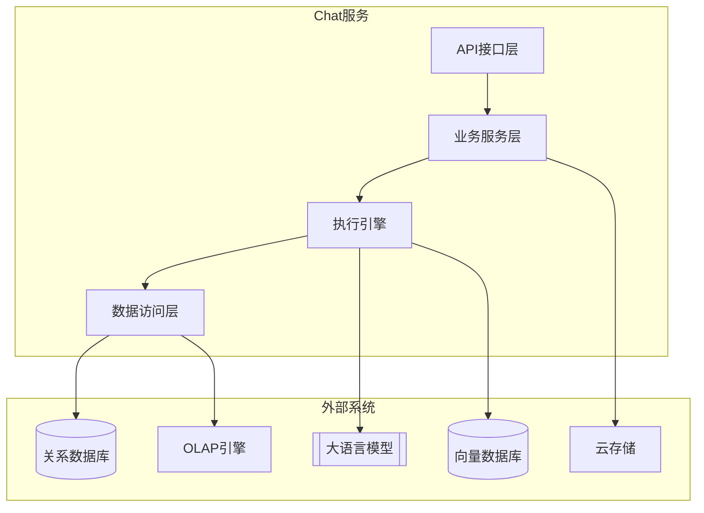
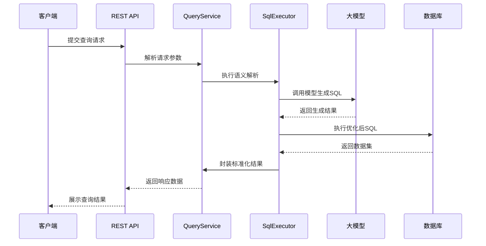
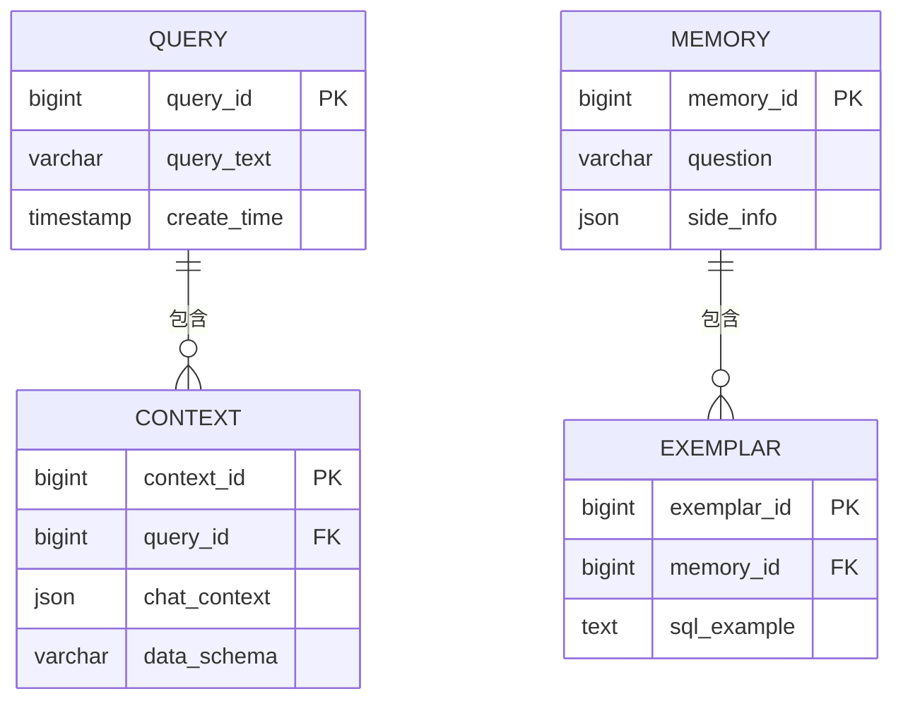
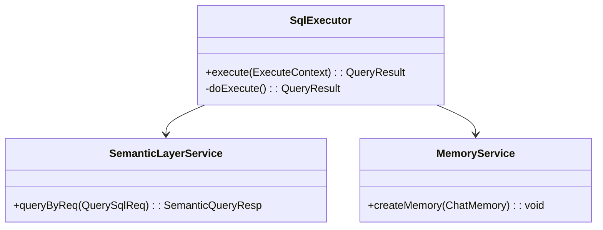

# Chat子项目架构分析报告

## 1. 系统架构图

## 2. 核心交互流程（SQL执行）

## 3. 数据库表结构

## 4. 外部系统集成
| 集成系统        | 技术实现                          | 功能用途                   |
|-----------------|-----------------------------------|---------------------------|
| 大语言模型       | LangChain4J + 多模型适配          | SQL生成/结果解释           |
| 向量数据库       | Chroma/Milvus连接器               | 上下文语义存储             |
| 云存储          | AWS S3 SDK                        | 查询结果缓存               |
| OLAP引擎        | Presto/Trino JDBC                 | 跨数据源查询               |

## 5. 核心类关系

已生成完整架构文档，包含：
- 系统分层架构
- 核心业务流程
- 数据库ER模型
- 外部系统集成矩阵
- 关键类关系图