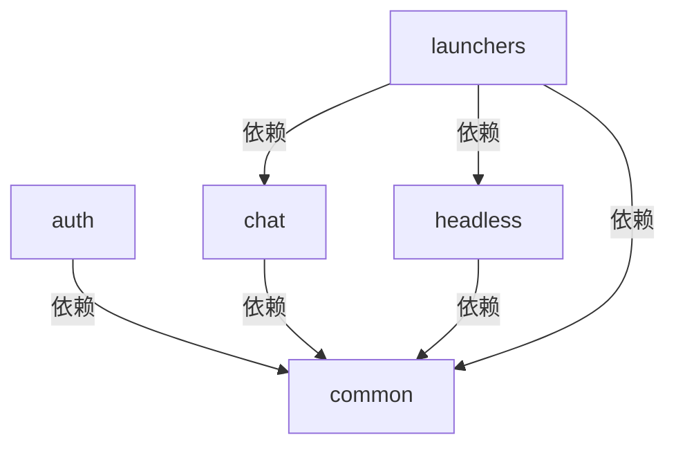

# Supersonic 项目架构分析报告

## 模块概览

## 模块详细描述

### auth 模块
- 功能：负责认证和授权
- 子模块：
  - api: 提供认证授权相关API
  - authentication: 处理用户认证
  - authorization: 处理用户授权
- 依赖：common

### chat 模块
- 功能：实现聊天功能
- 子模块：
  - api: 提供聊天相关API
  - server: 聊天服务端实现
- 依赖：common

### common 模块
- 功能：提供公共功能
- 依赖：
  - Spring Core
  - MyBatis Plus
  - LangChain4J
  - Lombok
  - 其他常用工具库

### headless 模块
- 功能：无头模式实现
- 子模块：
  - api: 提供无头模式API
  - server: 无头模式服务端实现
  - core: 核心功能
  - chat: 无头模式下的聊天功能
- 依赖：common

### launchers 模块
- 功能：负责启动和运行其他模块
- 子模块：
  - chat: 启动聊天功能
  - headless: 启动无头模式
  - common: 启动公共功能
  - standalone: 独立运行模式
- 依赖：chat, headless, common