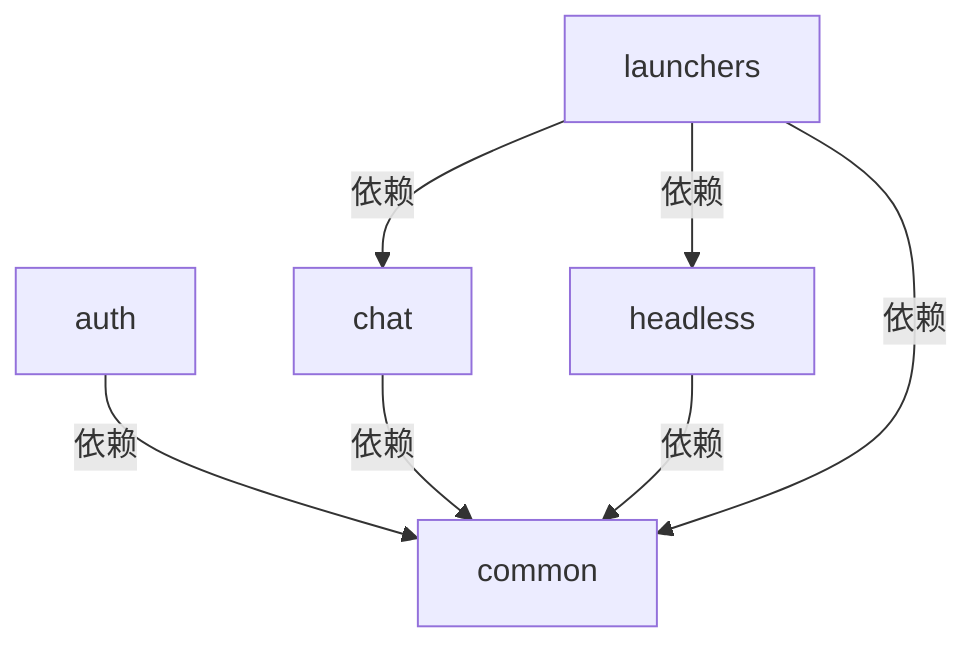
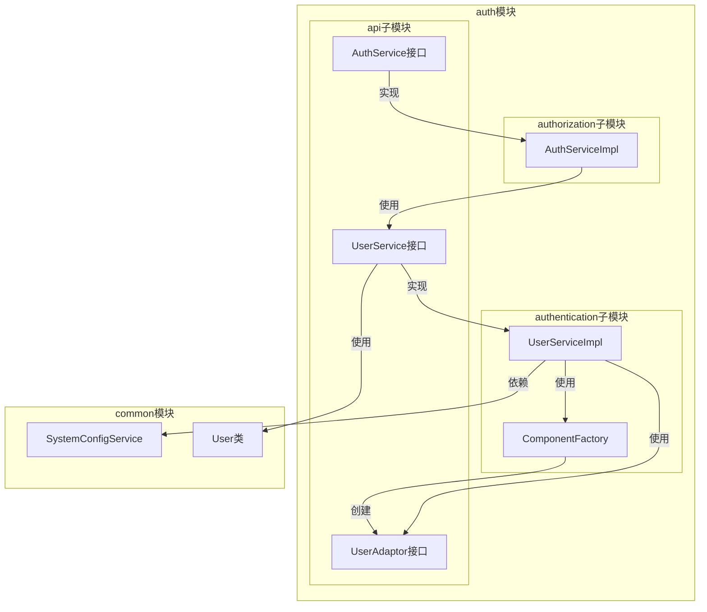
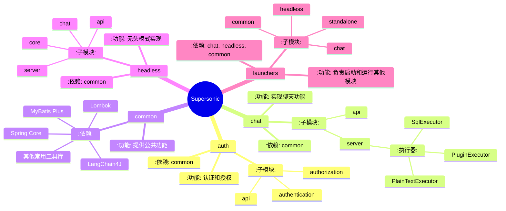

# Supersonic 项目结构分析报告

## 1. 模块概览


## 2. 模块详细描述

### auth 模块


#### 类图

```mermaid
classDiagram
    class UserService {
        <<interface>>
        +getCurrentUser(HttpServletRequest, HttpServletResponse): User
        +getUserNames(): List~String~
        +getUserList(): List~User~
        +register(UserReq): void
        +login(UserReq, HttpServletRequest): String
        +login(UserReq, String): String
        +getUserAllOrgId(String): Set~String~
        +getUserByOrg(String): List~User~
        +getOrganizationTree(): List~Organization~
        +getPassword(String): String
        +resetPassword(String, String, String): void
        +generateToken(String, String, long): UserToken
        +getUserTokens(String): List~UserToken~
        +getUserToken(Long): UserToken
        +deleteUserToken(Long): void
    }

    class UserServiceImpl {
        +getCurrentUser(HttpServletRequest, HttpServletResponse): User
        +getUserNames(): List~String~
        +getUserList(): List~User~
        +register(UserReq): void
        +login(UserReq, HttpServletRequest): String
        +login(UserReq, String): String
        +getUserAllOrgId(String): Set~String~
        +getUserByOrg(String): List~User~
        +getOrganizationTree(): List~Organization~
        +getPassword(String): String
        +resetPassword(String, String, String): void
        +generateToken(String, String, long): UserToken
        +getUserTokens(String): List~UserToken~
        +getUserToken(Long): UserToken
        +deleteUserToken(Long): void
    }

    class UserAdaptor {
        <<interface>>
        +getUserNames(): List~String~
        +getUserList(): List~User~
        +getOrganizationTree(): List~Organization~
        +register(UserReq): void
        +login(UserReq, HttpServletRequest): String
        +login(UserReq, String): String
        +getUserByOrg(String): List~User~
        +getUserAllOrgId(String): Set~String~
        +getPassword(String): String
        +resetPassword(String, String, String): void
        +generateToken(String, String, long): UserToken
        +deleteUserToken(Long): void
        +getUserToken(Long): UserToken
        +getUserTokens(String): List~UserToken~
    }

    class AuthService {
        <<interface>>
        +queryAuthGroups(String, Integer): List~AuthGroup~
        +addOrUpdateAuthGroup(AuthGroup): void
        +removeAuthGroup(AuthGroup): void
        +queryAuthorizedResources(QueryAuthResReq, User): AuthorizedResourceResp
    }

    class AuthServiceImpl {
        +queryAuthGroups(String, Integer): List~AuthGroup~
        +addOrUpdateAuthGroup(AuthGroup): void
        +removeAuthGroup(AuthGroup): void
        +queryAuthorizedResources(QueryAuthResReq, User): AuthorizedResourceResp
    }

    class ComponentFactory {
        +getUserAdaptor(): UserAdaptor
    }

    UserService <|.. UserServiceImpl
    UserServiceImpl --> UserAdaptor : uses
    UserServiceImpl --> ComponentFactory : uses
    AuthService <|.. AuthServiceImpl
    AuthServiceImpl --> UserService : uses
    ComponentFactory --> UserAdaptor : creates
```


#### 实体关系图
```mermaid
erDiagram
    USER ||--o{ USER_TOKEN : has
    USER ||--o{ ORGANIZATION : belongs to
    ORGANIZATION ||--o{ ORGANIZATION : parent-child
    
    USER {
        string name
        string password
        int isAdmin
    }
    
    USER_TOKEN {
        int id
        string name
        string userName
        string token
        long expireTime
        Date createDate
        Date expireDate
    }
    
    ORGANIZATION {
        string id
        string parentId
        string name
        string fullName
        boolean isRoot
    }
```

#### 设计特点总结
1. **模块化设计**：
   - 将认证和授权功能分离到不同的子模块
   - api子模块定义接口和DTO
   - authentication子模块实现认证功能
   - authorization子模块实现授权功能

2. **可扩展性**：
   - 使用UserAdaptor接口，支持不同的用户认证方式
   - 通过ComponentFactory动态加载UserAdaptor实现

3. **安全性**：
   - 使用Token机制管理用户会话
   - 支持密码重置功能
   - 提供组织级别的权限控制

4. **依赖管理**：
   - 依赖common模块提供公共功能
   - 使用SystemConfigService管理系统配置

5. **数据结构**：
   - 采用树形结构管理组织关系
   - 使用UserToken管理用户会话
   - 通过AuthGroup管理权限组

#### 模块间交互关系分析
1. **与common模块的交互**：
   - 使用SystemConfigService获取系统配置
   - 依赖User类作为核心数据模型

2. **内部模块间的交互**：
   - authentication模块依赖api模块定义的接口
   - authorization模块依赖authentication模块提供的用户信息
   - ComponentFactory负责创建和管理UserAdaptor实例

3. **与外部系统的交互**：
   - 通过UserAdaptor接口与外部用户系统集成
   - 使用JdbcTemplate与数据库交互，管理权限组信息

### chat 模块
- 功能：实现聊天功能
- 子模块：
  - api: 提供聊天相关API
  - server: 聊天服务端实现
    - executor: 包含PlainTextExecutor、PluginExecutor、SqlExecutor等执行器
- 依赖：common

### common 模块
- 功能：提供公共功能
- 依赖：
  - Spring Core
  - MyBatis Plus
  - LangChain4J
  - Lombok
  - 其他常用工具库

### headless 模块
- 功能：无头模式实现
- 子模块：
  - api: 提供无头模式API
  - server: 无头模式服务端实现
  - core: 核心功能
  - chat: 无头模式下的聊天功能
- 依赖：common

### launchers 模块
- 功能：负责启动和运行其他模块
- 子模块：
  - chat: 启动聊天功能
  - headless: 启动无头模式
  - common: 启动公共功能
  - standalone: 独立运行模式
- 依赖：chat, headless, common



## 3. 项目特点总结

1. **模块化设计**：项目采用模块化设计，各模块职责清晰，便于维护和扩展。
2. **依赖管理**：通过Maven进行依赖管理，确保各模块的依赖关系清晰。
3. **插件化架构**：chat模块采用插件化架构，支持不同类型的查询执行器。
4. **无头模式支持**：headless模块提供无头模式实现，适用于自动化场景。
5. **独立启动器**：launchers模块提供独立启动器，便于快速启动和测试。

## 4. 下一步建议

1. 如果需要进一步了解项目的具体实现细节，可以深入分析各模块的核心代码。
2. 如果需要扩展项目功能，可以参考现有模块的设计模式，添加新的模块或插件。
3. 如果需要优化项目性能，可以分析各模块的依赖关系，优化模块间的调用。